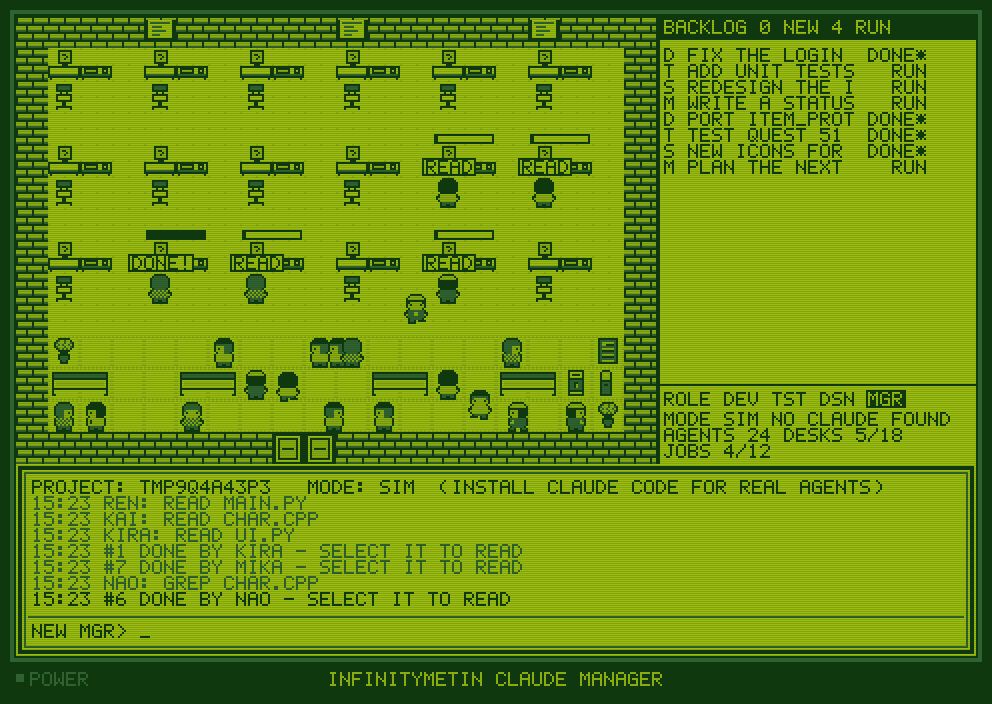

# InfinityMetin Claude Manager

A Game Boy Color style office where your Claude Code agents work on your project. Type a task,
pick a role, press Enter: an agent walks to a desk and a real Claude Code session runs the task
in your project folder. Read the answer in the dialog box, type a reply, and the same session
continues.



- 24 agents in four roles: Developer, Tester, Designer, Manager (each with its own look).
- Backlog panel with a text input; agents pick tasks that match their role, walk to a free desk,
  show a progress bar, and go back to the lounge when done.
- Four-colour green palette, 5x7 pixel font, handheld frame, optional LCD grid (Ctrl+G).
- Chiptune sounds generated in code: rising blip on a new task, two-tone fanfare on completion.
- Without Claude Code installed (or with `--sim`) it runs as a simulation, so it always starts.

## Get the exe

Every push to this folder builds `InfinityMetin Claude Manager.exe` on GitHub's Windows machines:
open the repository's **Actions** tab, pick the latest *InfinityMetin Claude Manager* run, and
download the `InfinityMetin-Claude-Manager-windows` artifact (a zip with the exe inside).

To build it yourself on Windows: install Python from python.org (tick "Add python.exe to PATH"),
then double-click `build_exe.bat`. The exe appears in `dist\`.

Or run from source anywhere: `pip install pygame` then `python infinitymetin_claude_manager.py`.

## Using it with Claude Code

1. Install Claude Code and log in once in a terminal (`claude`), so it has your account.
2. Start the game in your project folder, or point it there:

   ```
   "InfinityMetin Claude Manager.exe" --project "D:\Metin2\Server"
   ```

   You can also drop a folder onto the game window to switch project (when nothing is running).
   Make a shortcut with `--project` in its target for one-click starts.
3. Type a task, press Tab to choose the role, press Enter. Watch the agent's speech bubble: READ,
   EDIT, BASH, GREP... are the tools Claude is using. The dialog box logs what each agent does.
4. When the panel shows `DONE*`, select the task (Up/Down or click it) to read the answer. Type a
   reply and press Enter: the same Claude session continues with your reply.
5. Close the game whenever you like. Tasks and answers are saved per project under
   `%USERPROFILE%\.infinitymetin_claude_manager\`, and replies still resume the saved sessions.

Agents run as `claude -p` in the project folder with `--permission-mode acceptEdits`: they can read
and edit files, but commands (Bash) that Claude Code would normally ask you about are denied, and
the answer says so. To allow more:

| Option | Effect |
| --- | --- |
| `--allowed-tools "Bash(git *),Bash(npm test)"` | Allow specific commands without asking. |
| `--permission-mode plan` | Agents only read and plan; nothing is changed. |
| `--bypass-permissions` | Agents may run any command (Claude Code's `--dangerously-skip-permissions`). Use only in a folder you can afford to break. |
| `--max-turns 30` | Limit how long a single task may run. |
| `--max-budget-usd 1.00` | Spending cap per task. |
| `--model claude-opus-5` | Model for the agents. |
| `--max-jobs 2` | How many Claude sessions run at the same time (default 4). |

Other options: `--sim` (simulation only), `--claude PATH` (if claude is not on PATH), `--agents 30`,
`--scale 2`, `--no-sound`, `--no-grid`, `--fresh` (ignore the saved task list).

## Keys

| Key | Action |
| --- | --- |
| Type + Enter | New task (or a reply when a finished task is selected) |
| Tab / Shift+Tab | Choose the role for new tasks |
| Up / Down, click | Select a task; Esc goes back to new-task mode |
| PgUp / PgDn, wheel | Scroll the answer |
| Delete | Cancel a running task, or remove a finished one from the list |
| Ctrl+C / Ctrl+V | Copy the answer / paste into the input |
| Ctrl+M, Ctrl+G | Mute, LCD grid on/off |
| F1, Ctrl+Q | Help, quit |

## Notes

- The roles are system-prompt flavours for Claude Code: the Developer implements, the Tester
  only tests and reports, the Designer handles UI/text/assets, the Manager plans and reviews
  without changing code. Any role can be given any task.
- The canvas is strictly the four palette colours (the tests check every pixel). The LCD grid
  overlay is drawn on top of the scaled image with transparency; turn it off with Ctrl+G if you
  want the raw four colours on screen.
- Each running task is its own Claude Code session, so several agents can work at once.
  Costs come from Claude Code's own accounting and are shown per task and in total.

## Development

```
pip install pygame pytest
SDL_VIDEODRIVER=dummy SDL_AUDIODRIVER=dummy python -m pytest -q tests
```

The tests drive the game headless, run a fake `claude` that speaks the same streamed JSON as the
real CLI, and check that only the four palette colours ever reach the canvas.
