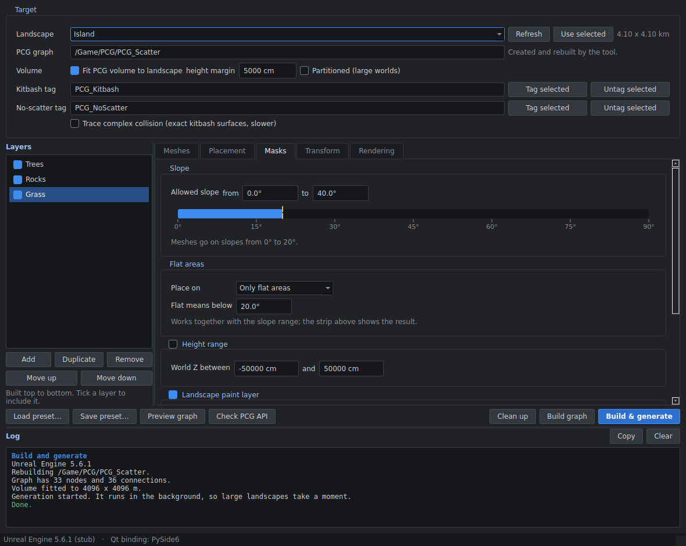

# PCG Scatter Tool for Unreal Engine 5.6

One Python file, `pcg_scatter_tool.py`, with a Qt window (PySide6 or PyQt6). It builds a PCG graph from
lists of static meshes and fills a landscape with them, both on the landscape itself and on top of
kitbash meshes placed on it. You control slope, flat areas, height, paint layers, patches, spacing,
scale, rotation and culling per layer.



## What it builds

Each layer becomes a chain of PCG nodes in one graph. Layers are built top to bottom:

```
surface -> Surface Sampler -> slope filter -> height range -> paint layer -> patches
        -> keep off kitbash -> spacing -> keep clear of layers above -> Transform Points -> Static Mesh Spawner
```

Steps a layer doesn't use are left out. The surface decides where points can land:

| Surface | How it works |
| --- | --- |
| Landscape + kitbash meshes | A World Ray Hit Query casts rays straight down through the volume. Points land on whatever is on top: the tops of kitbash meshes where they sit on the landscape, the landscape everywhere else. |
| Landscape only | Get Landscape Data. Supports paint-layer masks and can keep points off kitbash meshes. |
| Kitbash meshes only | Rays only hit actors carrying the kitbash tag, e.g. moss or debris on rock formations. |

The tool also places a PCG Volume sized to the landscape (and to any tagged kitbash meshes sticking out
of it), assigns the graph and generates.

## Requirements

- Unreal Engine 5.6 with these plugins enabled: Procedural Content Generation Framework, Python Editor
  Script Plugin, Editor Scripting Utilities.
- PySide6 (recommended) or PyQt6 installed into the engine's Python, as below.

## Install

1. Put `pcg_scatter_tool.py` anywhere, for example `D:/Tools/pcg_scatter_tool.py`.
2. Close the editor and install PySide6 into your project using Unreal's own Python (adjust both paths):

   ```bat
   "C:\Program Files\Epic Games\UE_5.6\Engine\Binaries\ThirdParty\Python3\Win64\python.exe" -m pip install --target "D:\MyProject\Content\Python\Lib\site-packages" PySide6
   ```

   The tool adds that folder to Python's path itself.
3. Start the editor. In the Output Log, set the input box to **Cmd** and run:

   ```
   py "D:/Tools/pcg_scatter_tool.py"
   ```

   Running it again closes the old window and opens a fresh one, which also picks up an updated file.

## First run: check the PCG API

PCG's Python API changes between engine versions, and this tool has not been run inside Unreal yet.
Press **Check PCG API** first. It builds a test graph in memory (nothing is saved or placed in your level)
and logs which node classes, properties and pins worked. If a line says FAILED, WARNING or ERROR, press
**Copy** and send the log along so the tool can be adjusted.

## Using it

1. **Landscape**: pick it from the list, or select it in the level and press **Use selected**. In World
   Partition levels, load the whole landscape region first so the tool can measure it.
2. **Kitbash meshes**: select them in the level and press **Tag selected** next to *Kitbash tag*. Tagged
   meshes are used by *Kitbash meshes only* layers and by *Keep off kitbash meshes*. The volume is also
   made tall enough for them. They need collision for the ray-based surfaces.
3. **No-scatter tag**: in *Landscape + kitbash meshes* layers, rays hit anything with collision. Tag
   buildings, water planes and props you don't want to scatter on, and the rays pass through them.
4. **Layers**: Trees, Rocks and Grass examples are included. On each layer's **Meshes** tab, select meshes
   in the Content Browser and press **Add from Content Browser**, then go through the other tabs.
5. Press **Build & generate**. The log says what happened, and a warning names any step that was skipped.

## Controls

| Where | Control | What it does |
| --- | --- | --- |
| Target | Landscape | The landscape to fill. |
| Target | PCG graph | Asset path the tool creates and rebuilds. |
| Target | Fit PCG volume to landscape, height margin | Sizes the volume to the landscape plus the margin above and below. |
| Target | Partitioned (large worlds) | Generates in World Partition cells instead of one component. |
| Target | Kitbash tag, No-scatter tag | Tags that mark kitbash meshes and actors the rays ignore. |
| Target | Trace complex collision | Exact kitbash surfaces for the rays (slower). |
| Meshes | Static mesh, Weight | The meshes for this layer and how often each is picked. |
| Placement | Surface | Where points can land (see the table above). |
| Placement | Density | Candidate points per m² before masks. The estimate below it is for the chosen landscape. |
| Placement | Seed | Change it for a different random layout. |
| Placement | Footprint radius | Space each point claims, used for spacing and by later layers. |
| Placement | Remove overlapping points | Minimum spacing equal to the footprint. |
| Placement | Keep clear of the layers above | Removes points whose footprint overlaps an earlier layer's, so the gap is about both radii added together. |
| Placement | Keep off kitbash meshes | Landscape only: removes points inside the collision of tagged kitbash meshes. |
| Masks | Slope | Allowed slope range, 0° flat to 90° vertical. |
| Masks | Flat areas | Flat and sloped ground, only flat areas, or no flat areas, with the flat limit in degrees. The strip in the Slope box shows the combined result. |
| Masks | Height range | World Z range in cm. |
| Masks | Landscape paint layer | Only where a paint layer's weight reaches the minimum (Landscape only surface). |
| Masks | Patches | Perlin noise that breaks the layer into clumps: patch size and coverage. |
| Transform | Scale | Uniform random scale range. |
| Transform | Rotation, tilt | Random yaw and a random tilt up to the given angle. |
| Transform | Align to the surface | Follow the surface normal, or stay upright. |
| Transform | Z offset | Negative values sink meshes into the ground. |
| Rendering | Cull distance, Collision, Cast shadows | Settings for the spawned instances. |

## Good to know

- **The tool owns its graph.** Every build deletes the graph's nodes and rebuilds them from the settings.
  It marks the graphs it creates and refuses to touch any other PCG graph, so use a new path rather than
  an existing graph.
- **Slope** comes from the surface normal. *Normal To Density* writes cos(slope) into the point density,
  and a density filter keeps the chosen range.
- **Heavy layers:** above about 3 million candidate points, lower the density or tick *Partitioned*.
- **Presets** are JSON files (Load/Save preset). The last session is saved to
  `<YourProject>/Saved/PCGScatterTool/last_session.json` and reopens with the tool.
- **Outside Unreal**, `python pcg_scatter_tool.py` opens the window for editing presets.

## Known limits

- Written for UE 5.6, but not yet run inside Unreal. See *First run* above.
- *Landscape + kitbash meshes* layers use downward rays, so they reach the tops of kitbash meshes, not
  overhangs or vertical faces.
- If slope limits seem to have no effect on *Landscape + kitbash meshes* layers, the ray hits may not carry
  the surface normal in your engine version. Report it, since that mode would need a different sampling method.
- Paint-layer masks only work on *Landscape only* layers.
- If your engine version doesn't let Python set node positions, the nodes are stacked in the graph
  editor. The graph still works.

## Licensing note

PyQt6 is licensed under the GPL or a paid commercial licence; PySide6 is LGPL. If you plan to sell or share
this tool (for example on Fab), PySide6 is the safer choice. The tool works with either and picks PySide6
first. Set the environment variable `PCG_SCATTER_QT=PyQt6` to force PyQt6.

## Development

The tests (not needed to use the tool) run outside Unreal with a stand-in for the `unreal` module
(`tests/fake_unreal.py`). They check the tool's logic, not Unreal's real API.

```bash
pip install pytest PySide6 PyQt6
PCG_SCATTER_QT=PySide6 python -m pytest tests
PCG_SCATTER_QT=PyQt6 python -m pytest tests
```
